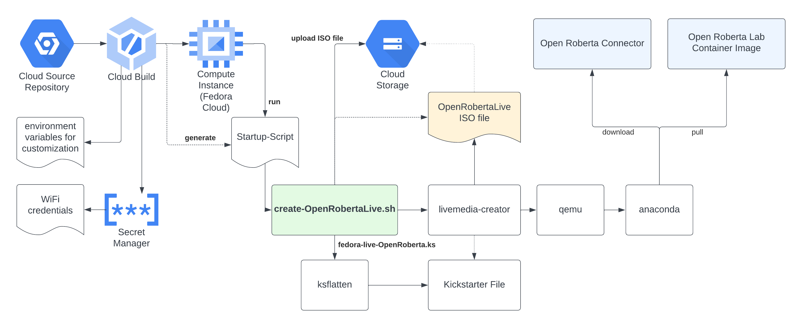

# Abstract

This project proposes a custom Live Linux called Open Roberta Live for conducting Roberta courses at scale, minimizing setup efforts and dependencies. Open Roberta Live is booted from a medium and comprises all software to get started with the Open Roberta Lab and supported Bots and Boards. This project realizes the generation of a bootable ISO file that can be used for this purpose.

# Background

Participants of a [Roberta](https://www.roberta-home.de/) course, in general,
need a laptop with [Open Roberta Connector](https://github.com/OpenRoberta/openroberta-connector) (only supported with Linux, MacOS, and Windows and requires a Java Runtime), an USB Port, and a web browser with access to an [Open Roberta Lab](https://github.com/OpenRoberta/openroberta-lab) server to program
[OpenRoberta supported devices](https://www.open-roberta.org/bots-und-boards/).

# Benefits

- Using Open Roberta Live, laptops as used for Roberta® courses do not have to be dedicated for this purpose.  
  Any laptop with minimal system requirements (e.g., 4GB RAM) that permits booting from a medium such as a USB drive, can be used.
- Open Roberta Live comprises, beyond the Linux operating system, all software dependencies to get started with [Open Roberta®](https://www.open-roberta.org/).
- Open Roberta Live provides an ephemeral user experience, i.e., after a reboot the system is always in a clean state.
- Apart, Open Roberta Live starts all software during boot and automatically opens a browser with Open Roberta Lab
- Eliminates network dependencies; that said, a WiFi connection can be preconfigured if wished.
- Permits scale by writing and distributing boot media.

# Requirements for using Open Roberta Live

- RAM: >= 4GB
- Architecture: amd64
- Boot from external medium (e.g., USB or SD Card) possible

# Requirements for building an Open Roberta Live image

- [Fedora Linux](https://fedoraproject.org/) (>= Release 37)
- super user (`root`) privileges

# Architectural Diagram

The diagram below outlines how a(n automated) build process can look like using some [Google Cloud](https://cloud.google.com) products.

